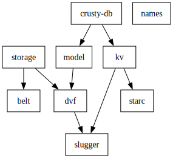

# app-core

This repository contains the domain-independent crates shared by a few of my
projects (
[rambit](https://github.com/rambit-systems/rambit),
[picturepro](https://github.com/picture-pro/mono),
etc).

## Crate Map

## Crates

**Hexagonal:**
- `db` - model-based database adapter interface.
- `health` - health check framework.
- `hex` - foundational hexagonal architecture traits.
- `kv` - key-value store interface and types, and TiKV implementer.
- `storage` - storage interface and implementers.

**Data:**
- `belt` - multipurpose byte streaming container.
- `dvf` - usage-specific newtypes used in models.
- `model` - domain model interface.
- `slugger` - slug types.
- `starc` - smart pointer for static, owned, or ref-counted data.

**Miscellaneous:**
- `art` - macro-based ASCII art.
- `names` - name generator.
